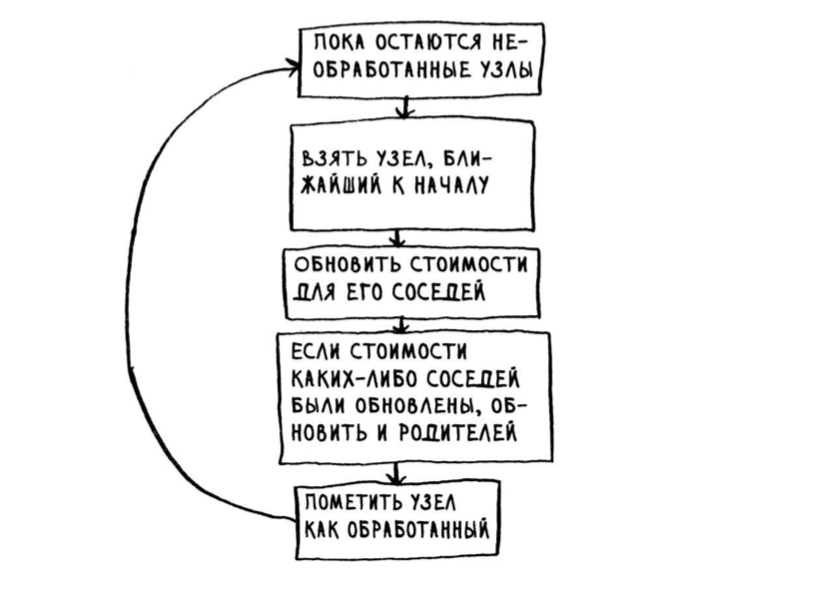
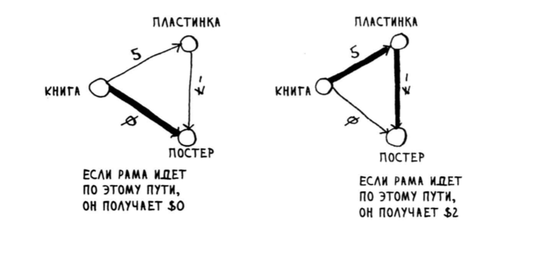
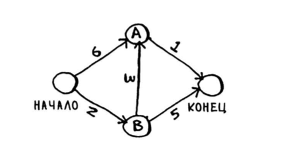

# Глава 7. Алгоритм Дейкстры

Каждому ребру графа можно присвоить определенный вес, тогда граф называется взвешенным. В таком графе кратчайший путь - это необязательно путь, состоящий из минимального количества сегментов. Поэтому для поиска во взвешенном графе используется другой алгоритм.

## Работа с алгоритмом Дейкстры

Алгоритм Дейкстры состоит из четырех шагов:

1. Найти узел с наименьшей стоимостью (то есть узел, до которого можно добраться за минимальное время).
2. Обновить стоимости соседей этого узла.
3. Повторять, пока это не будет сделано для всех узлов графа.
4. Вычислить итоговый путь.



Ключевая идея алгоритма Дейкстры: в графе ищется путъ с наименъшей стоимостъю. Пути к этому узлу с менъшими затратами не существует!

В ненаправленном графе каждое ребро - это цикл.

Алгоритм Дейкстры работает только с направленными ациклическими графами - DAG (Directed Acyclic Graph).

[Пример поиска кратчайшего пути по алгоритму Дейкстры](./example)

## Ребра с отрицательным весом

Алгоритм Дейкстры не работает в графе, ребра которого имеют отрицательный вес. Это ломает работу алгоритма.

Предполагается, что до уже обработанных узлов нельзя добраться дешевле, чем уже рассчитано. Но отрицательные ребра могут привести к такой ситуации.



От Книги до Постера можно добраться за цену 0. Это самый близкий узел к Книге. Не должно существовать пути дешевле. Но из-за отрицательного ребра путь Книга-Пластинка-Постер получается равен -2.

> Алгоритм Дейкстры предположил, что, поскольку вы обрабатываете узел «постер», к этому узлу невозможно добраться быстрее.
>
> Это предполо­жение работает только в том случае, если ребер с отрицательным весом не существует. Следовательно, использование алгоритма Дейкстры с графом, содержащим ребра с отрицательным весом, невозможно.
>
> Если вы хотите найти кратчайший путь в графе, содержащем ребра с отрицательным весом, для этого существует специальный алгоритм, называемый алгоритмом Беллмана-Форда.

## Реализация

***
***

Для программной реализации используем простой граф:




Код:
```
// представление графа в виде хеш-таблицы
const graph = {
  "start": {
    "a": 6,
    "b": 2
  },
  "a": {
    "finish": 1
  },
  "b": {
    "a": 3,
    "finish": 5
  },
  "finish": {}
};

console.log(dijkstra(graph, "start", "finish"));
// { cost: 6, path: 'start->b->a>finish' }
```

[Код функции dijkstra](./dijkstra.js)

Команда для проверки:

```
npm run dijkstra
```

***
***

## Упражнения

[Упражнения к главе 7](./exersizes)
